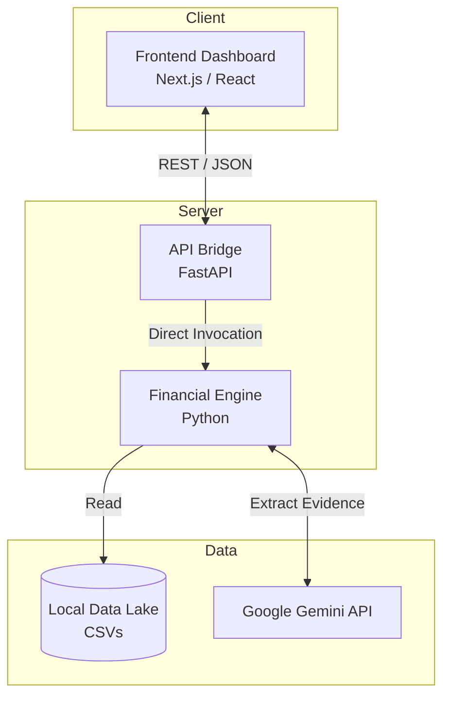

<div align="center">
  <h1>AURELIS</h1>
  <p><b>Privacy-First AI Financial Intelligence & Affordability Agent</b></p>
  <p> </p> Financial Intelligence & Affordability Agent</b></p>
  
  <p>
    <a href="https://github.com/m4n1kya/AURELIS/commits/main"></a>
    <a href="https://github.com/m4n1kya/AURELIS/issues"></a>
    <a href="https://github.com/m4n1kya/AURELIS/blob/main/LICENSE"></a>
  </p>
</div>

---

AURELIS is an advanced, privacy-first AI financial agent that deterministically evaluates your affordability and builds optimized payment plans based on your true cash flow, upcoming liabilities, and required minimum reserves.

Unlike static budgeting apps, AURELIS analyzes your 90-day cash flow projection—inclusive of expected bills, currency conversions, and LLM-extracted unstructured evidence—to tell you exactly how much you can afford *right now* and how to finance the rest safely.

## ✨ Features

- **Deterministic Financial Engine**: Built on a highly strict cash-flow simulation engine that guarantees you never drop below your absolute minimum reserve.
- **Multimodal Evidence Processing**: Uses Google Gemini to extract verifiable financial constraints from unstructured messages and receipts, falling back to safe defaults if API limits are hit.
- **Dynamic Payment Planning**: Autonomously ranks and schedules optimal payment plans if an item isn't affordable upfront.
- **Premium Fintech Dashboard**: A high-end Next.js UI built for visualizing your 90-day financial forecast and exploring engine decisions in real time.

## 🏗️ Architecture

AURELIS is built with a strictly separated architecture to ensure the core financial engine remains unpolluted by presentation logic.



- **`engine/`**: The core deterministic Python financial engine. Operates entirely independently without any web server dependencies.
- **`api/`**: A lightweight FastAPI bridge that securely wraps the deterministic engine to serve JSON payloads to the frontend.
- **`frontend/`**: An ultra-premium React dashboard built with Tailwind CSS, Framer Motion, and Recharts.
- **`dataset/`**: Local CSV-based data lake acting as your private financial history and requests ledger.

## 🚀 Getting Started

### Prerequisites

- **Python**: `3.10+`
- **Node.js**: `18+` (for the dashboard)
- **API Key**: Google Gemini API Key

### 1. Clone the Repository

```bash
git clone https://github.com/m4n1kya/AURELIS.git
cd AURELIS
```

### 2. Environment Setup

Copy the example environment file and configure your API key:

```bash
cp .env.example .env
```
Add your Google Gemini API key to the `.env` file.

### 3. Backend Setup (Engine & API)

Install the required Python dependencies:

```bash
pip install -r requirements.txt
```

Start the FastAPI backend server:

```bash
python -m uvicorn api.main:app --port 8000 --reload
```
*The API will be available at `http://localhost:8000`*

*(Alternatively, you can run the core engine purely in the CLI for batch processing by executing `python engine/main.py`)*

### 4. Frontend Setup

In a new terminal window, initialize and run the Next.js application:

```bash
cd frontend
npm install
npm run dev
```

Navigate to `http://localhost:3000` to access your AURELIS command center.

## 🛡️ License

This project is licensed under the MIT License - see the [LICENSE](LICENSE) file for details.
